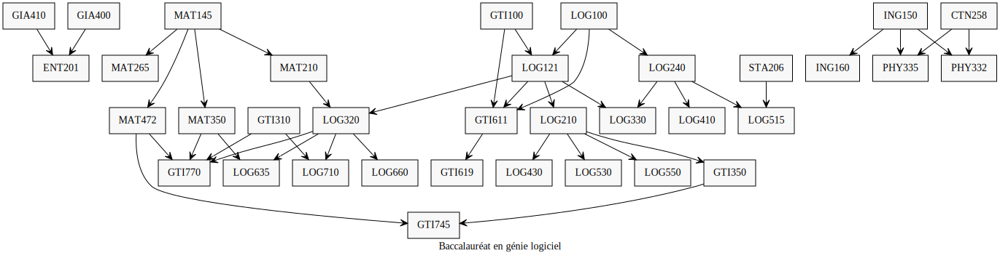

# Générateur d'organigramme du baccalaureats de ÉTS

Permet de générer des organigrammes depuis les pdf de : https://www.etsmtl.ca/Etudiants/Horaire-cours

Ceux sous la section `Grilles de choix de cours et horaires`

Exemple: 

Utilisation:

`pipenv run python organigrammETS.py [file1] [file2] [file3] ...`

